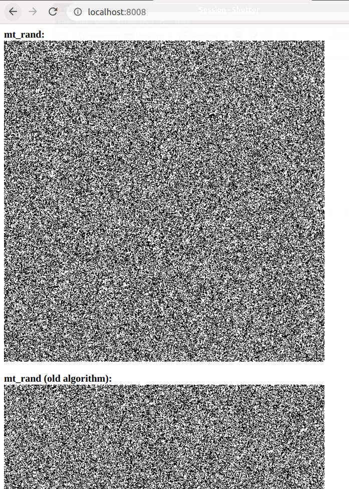

# random
An attempt to check whether different PHP randomization functions demonstrate noticeably different distributions (spoiler: not too much).

Image generation code has been taken here: https://boallen.com/random-numbers.html

All you need to run this app is **[docker](https://www.docker.com/)** and **[docker-compose](https://docs.docker.com/compose/)**.

How to set up this app:
* Clone this repo: `git clone git@github.com:steel-archer/random.git`
* Go to the cloned directory: `cd random`
* Run docker: `docker-compose up -d`
* You can check how it works here: http://localhost:8008/
* Shut down docker after you finish: `docker-compose down --remove-orphans`

Used:
* PHP 7.4
* GD extension

How it looks:

